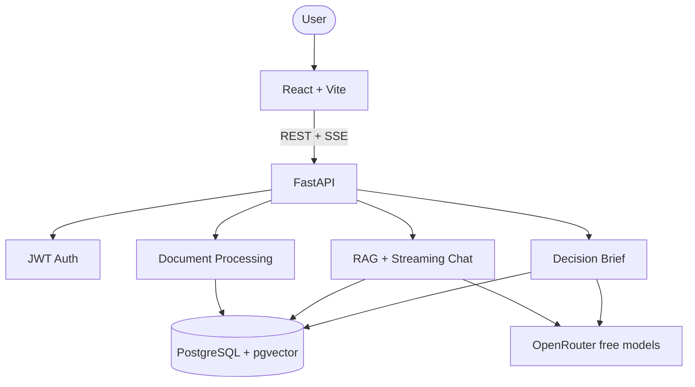

# Debrief

> Recover decisions buried in scattered team docs.

Built with [Codex](https://openai.com/codex/) for [OpenAI Build Week](https://openai.devpost.com/) · Runtime powered by **OpenRouter free models** · Work & Productivity

**Repo:** [github.com/YatharthSharma1309/debrief](https://github.com/YatharthSharma1309/debrief)

**Live demo:** [https://debrief-psi.vercel.app](https://debrief-psi.vercel.app)  
**API:** [https://debrief-api-production.up.railway.app](https://debrief-api-production.up.railway.app)  
*(Frontend: Vercel · Backend: Railway · DB: Neon · AI: OpenRouter free models)*

**Demo account:** `demo@debrief.app` / `DemoBuildWeek2026!`  
Workspace: **Launch Planning** (sample docs from `examples/launch-planning/`)  
Full access notes: [docs/CREDENTIALS.md](docs/CREDENTIALS.md)

```bash
# with DB + OPENROUTER_API_KEY configured (https://openrouter.ai/keys)
cd backend
alembic upgrade head
python scripts/seed_demo.py
```

**Debrief** recovers **decisions, rationale, owners, risks, open questions, and dates** from scattered project docs, notes, launch plans, and transcripts. Upload files → generate a cited **Decision Brief** (structured rows with sources) → verify with cited follow-ups. Not another PDF chatbot.

## Why it matters

Teams rarely lose information because they lack documents. They lose it because decisions, rationale, owners, risks, and deadlines are buried across notes, docs, and transcripts.

Debrief helps fast-moving teams answer:

- What decisions have already been made?
- Why did we make them?
- Who owns the next actions?
- What risks or contradictions should we review?
- What is still unresolved before launch?

## Core features

| Feature | Description |
|---------|-------------|
| Decision Brief | Structured recovery: decisions (rationale, owner, confidence), risks/contradictions, dates, actions, owners roster — each with source chips |
| Cited follow-ups | Ask why / who owns / what’s open; streaming answers with excerpts + relevance % |
| Stale brief signal | Prompts regenerate when docs change after the brief was saved |
| Workspaces | Project context isolated by workspace and user |
| Multi-format Uploads | PDF, DOCX, and TXT (notes, transcripts, plans) |
| Suggested Questions | Decision-forcing prompts seeded from the brief |
| Auth + History | JWT auth and persistent chat sessions |
| Dark Mode | Light/dark UI |

## Demo scenario (5 minutes)

Use the included sample project context in [`examples/launch-planning`](examples/launch-planning):

1. Create a workspace named **Launch Planning** (or use the seeded demo account)
2. Upload all files from `examples/launch-planning/`
3. Click **Generate brief**
4. Ask: **What did we decide about pricing and why?**
5. Ask: **What is still unresolved before launch?**

This shows the wedge: Debrief is not a generic document chatbot — it recovers decisions and open risks from scattered team context.

## Architecture



More detail: [docs/ARCHITECTURE.md](docs/ARCHITECTURE.md) · [docs/ARCHITECTURE_DIAGRAM.md](docs/ARCHITECTURE_DIAGRAM.md)

## Tech stack

| Layer | Technology |
|-------|------------|
| Frontend | React, TypeScript, Vite, Tailwind CSS, React Router, TanStack Query, Zustand |
| Backend | FastAPI, Python, SQLAlchemy, Alembic |
| Database | PostgreSQL + pgvector (Neon in cloud) |
| AI | OpenRouter — chat `openrouter/free`, embeddings `nvidia/llama-nemotron-embed-vl-1b-v2:free` (2048-d) |
| Deployment | Vercel · Railway/Render · Neon |

## Quick start

### Prerequisites

- Node.js 20+, Python 3.11+, Docker Desktop (or Neon), [OpenRouter API key](https://openrouter.ai/keys) (free)

### 1. Database

```bash
docker compose up -d
```

Or use Neon Postgres with `pgvector` enabled and set `DATABASE_URL`.

### 2. Backend

```bash
cd backend
python -m venv .venv
.venv\Scripts\activate
pip install -r requirements.txt
copy .env.example .env
# set OPENROUTER_API_KEY (defaults already use free OpenRouter models)
alembic upgrade head
uvicorn app.main:app --reload
```

API docs: http://localhost:8000/docs

### 3. Frontend

```bash
cd frontend
npm install
npm run dev
```

App: http://localhost:5173

## API overview

| Endpoint | Description |
|----------|-------------|
| `POST /api/auth/register` | Create account |
| `POST /api/auth/login` | Get JWT token |
| `GET/POST /api/workspaces` | List/create workspaces |
| `POST /api/workspaces/{id}/documents` | Upload file |
| `POST /api/workspaces/{id}/summary` | Generate + **persist** decision brief |
| `GET /api/workspaces/{id}/summary` | Load saved decision brief |
| `GET /api/workspaces/{id}/suggested-questions` | Decision-focused prompts |
| `POST /api/workspaces/{id}/chat/sessions/{sid}/messages` | Stream cited chat (SSE) |

## OpenAI Build Week

**Track:** Work & Productivity

**Positioning:** Decision recovery for launch/review — cited decisions, rationale, owners, risks, and open loops from scattered team docs. Built with Codex; inference runs on OpenRouter free models so demos stay $0 to operate. See [docs/COMPETITIVE_LANDSCAPE.md](docs/COMPETITIVE_LANDSCAPE.md).

### Built with Codex

Codex (via Cursor) accelerated FastAPI scaffolding, pgvector retrieval, SSE streaming, schema design, OpenRouter wiring, deployment config, and packaging. Product direction focuses on trust: every answer stays grounded in workspace sources and shows where it came from.

### OpenRouter usage (runtime)

- **Embeddings:** `nvidia/llama-nemotron-embed-vl-1b-v2:free` → pgvector (2048-d)
- **Decision briefs:** free auto-routed chat model (`openrouter/free`) → structured JSON
- **Streaming chat:** retrieved context + `[Source N]` citations via OpenRouter

## Launch checklist

1. Local E2E — [docs/LAUNCH_CHECKLIST.md](docs/LAUNCH_CHECKLIST.md)
2. Deploy — [docs/DEPLOYMENT.md](docs/DEPLOYMENT.md)
3. Screenshots → `screenshots/`
4. Demo video — [docs/DEMO_SCRIPT.md](docs/DEMO_SCRIPT.md)
5. Devpost copy — [docs/DEVPOST_SUBMISSION.md](docs/DEVPOST_SUBMISSION.md)
6. Push to GitHub and submit

## Project structure

```text
debrief/
├── backend/          FastAPI + RAG
├── frontend/         React app
├── docs/             Architecture, competitive landscape, demo/Devpost, deployment
├── examples/         Sample launch-planning documents
├── screenshots/      Submission images
└── docker-compose.yml
```

## License

MIT — see [LICENSE](LICENSE)
