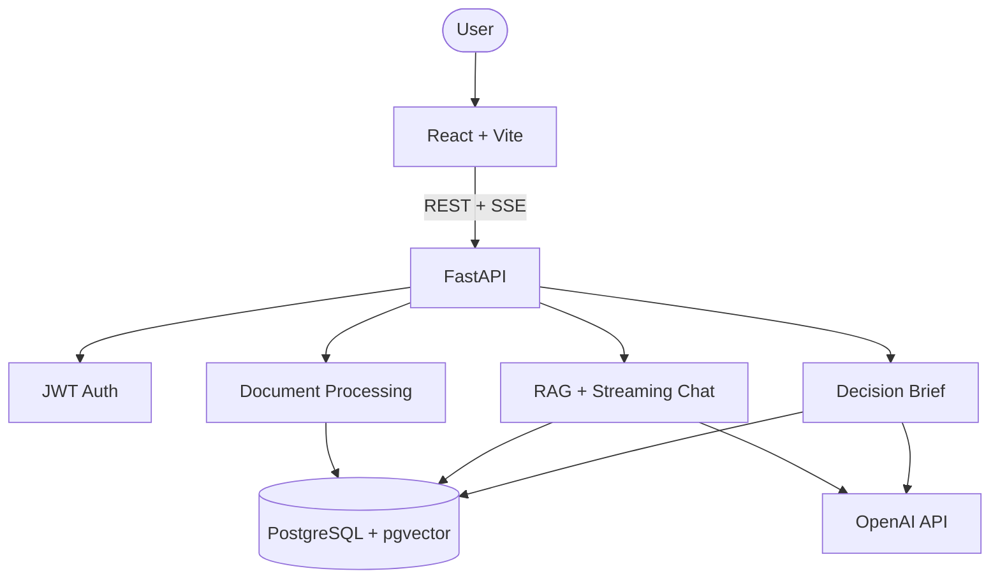

# Debrief

> Recover decisions buried in scattered team docs.

Built for [OpenAI Build Week](https://openai.devpost.com/) · Codex + GPT-5.6 · Work & Productivity

**Repo:** [github.com/YatharthSharma1309/debrief](https://github.com/YatharthSharma1309/debrief)

**Live demo:** *deploy pending — replace with your Vercel URL*

**Judge demo account** (after seeding): `demo@debrief.app` / `DemoBuildWeek2026!`  
Workspace: **Launch Planning** (sample docs from `examples/launch-planning/`)

```bash
# with DB + OPENAI_API_KEY configured
cd backend
alembic upgrade head
python scripts/seed_demo.py
```

**Debrief** turns scattered project documents, meeting notes, launch plans, and transcripts into a cited team-memory workspace. Upload files, generate a **decision brief**, then ask follow-up questions with streaming answers grounded in your sources.

## Why it matters

Teams rarely lose information because they lack documents. They lose it because decisions, rationale, owners, risks, and deadlines are buried across notes, docs, and transcripts.

Debrief helps fast-moving teams answer:

- What decisions have already been made?
- Why did we make them?
- Who owns the next actions?
- What risks or contradictions should we review?
- What is still unresolved before launch?

## Core features

| Feature | Description |
|---------|-------------|
| Decision Brief | Key decisions, open questions, risks, dates, and action items |
| Cited RAG Chat | Streaming answers with source citations, excerpts, and relevance % |
| Workspaces | Project context isolated by workspace and user |
| Multi-format Uploads | PDF, DOCX, and TXT |
| Suggested Questions | Decision-focused follow-up prompts |
| Auth + History | JWT auth and persistent chat sessions |
| Dark Mode | Light/dark UI |

## Demo scenario (5 minutes)

Use the included sample project context in [`examples/launch-planning`](examples/launch-planning):

1. Create a workspace named **Launch Planning**
2. Upload all files from `examples/launch-planning/`
3. Click **Generate brief**
4. Ask: **What did we decide about pricing and why?**
5. Ask: **What is still unresolved before launch?**

This shows the wedge: Debrief is not a generic document chatbot — it recovers decisions and open risks from scattered team context.

## Architecture



More detail: [docs/ARCHITECTURE.md](docs/ARCHITECTURE.md) · [docs/ARCHITECTURE_DIAGRAM.md](docs/ARCHITECTURE_DIAGRAM.md)

## Tech stack

| Layer | Technology |
|-------|------------|
| Frontend | React, TypeScript, Vite, Tailwind CSS, React Router, TanStack Query, Zustand |
| Backend | FastAPI, Python, SQLAlchemy, Alembic |
| Database | PostgreSQL + pgvector |
| AI | GPT-5.6 (`gpt-5.6-terra`) + `text-embedding-3-small` |
| Deployment | Vercel · Railway/Render · Supabase |

## Quick start

### Prerequisites

- Node.js 20+, Python 3.11+, Docker Desktop, OpenAI API key

### 1. Database

```bash
docker compose up -d
```

### 2. Backend

```bash
cd backend
python -m venv .venv
.venv\Scripts\activate
pip install -r requirements.txt
copy .env.example .env
# set OPENAI_API_KEY (and optionally OPENAI_CHAT_MODEL=gpt-5.6-terra)
alembic upgrade head
uvicorn app.main:app --reload
```

API docs: http://localhost:8000/docs

### 3. Frontend

```bash
cd frontend
npm install
npm run dev
```

App: http://localhost:5173

## API overview

| Endpoint | Description |
|----------|-------------|
| `POST /api/auth/register` | Create account |
| `POST /api/auth/login` | Get JWT token |
| `GET/POST /api/workspaces` | List/create workspaces |
| `POST /api/workspaces/{id}/documents` | Upload file |
| `POST /api/workspaces/{id}/summary` | Generate + **persist** decision brief |
| `GET /api/workspaces/{id}/summary` | Load saved decision brief |
| `GET /api/workspaces/{id}/suggested-questions` | Decision-focused prompts |
| `POST /api/workspaces/{id}/chat/sessions/{sid}/messages` | Stream cited chat (SSE) |

## OpenAI Build Week

**Track:** Work & Productivity

**Positioning:** Memory infrastructure for fast-moving teams — cited decisions, risks, action items, and follow-up answers powered by GPT-5.6 and built with Codex.

### Built with Codex

Codex (via Cursor) accelerated FastAPI scaffolding, pgvector retrieval, SSE streaming, schema design, deployment config, and packaging. Product direction focuses on trust: every answer stays grounded in workspace sources and shows where it came from.

### GPT-5.6 usage

- **Embeddings:** `text-embedding-3-small` → pgvector
- **Decision briefs:** GPT-5.6 structured JSON (decisions, open questions, risks, dates, actions)
- **Streaming chat:** GPT-5.6 + retrieved context + `[Source N]` citations

## Launch checklist

1. Local E2E — [docs/LAUNCH_CHECKLIST.md](docs/LAUNCH_CHECKLIST.md)
2. Deploy — [docs/DEPLOYMENT.md](docs/DEPLOYMENT.md)
3. Screenshots → `screenshots/`
4. Demo video — [docs/DEMO_SCRIPT.md](docs/DEMO_SCRIPT.md)
5. Devpost copy — [docs/DEVPOST_SUBMISSION.md](docs/DEVPOST_SUBMISSION.md)
6. Push to GitHub and submit

## Project structure

```text
debrief/
├── backend/          FastAPI + RAG
├── frontend/         React app
├── docs/             Architecture, deployment, Build Week plan
├── examples/         Sample launch-planning documents
├── screenshots/      Submission images
└── docker-compose.yml
```

## License

MIT — see [LICENSE](LICENSE)
