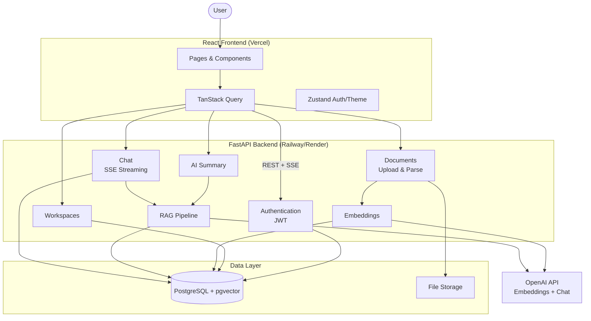
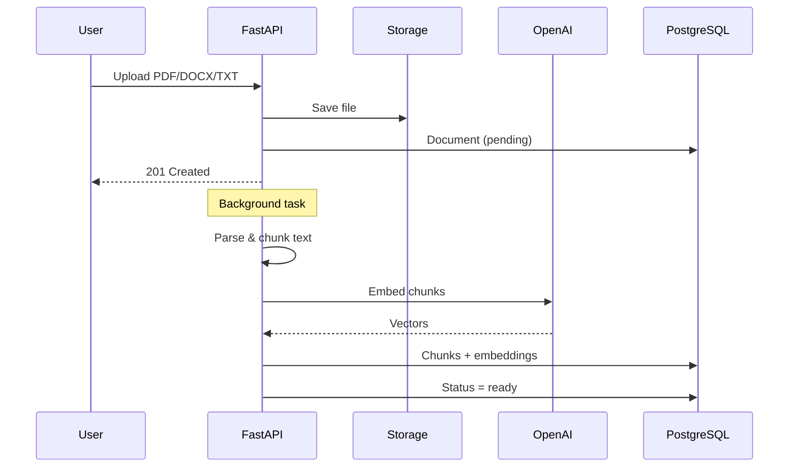
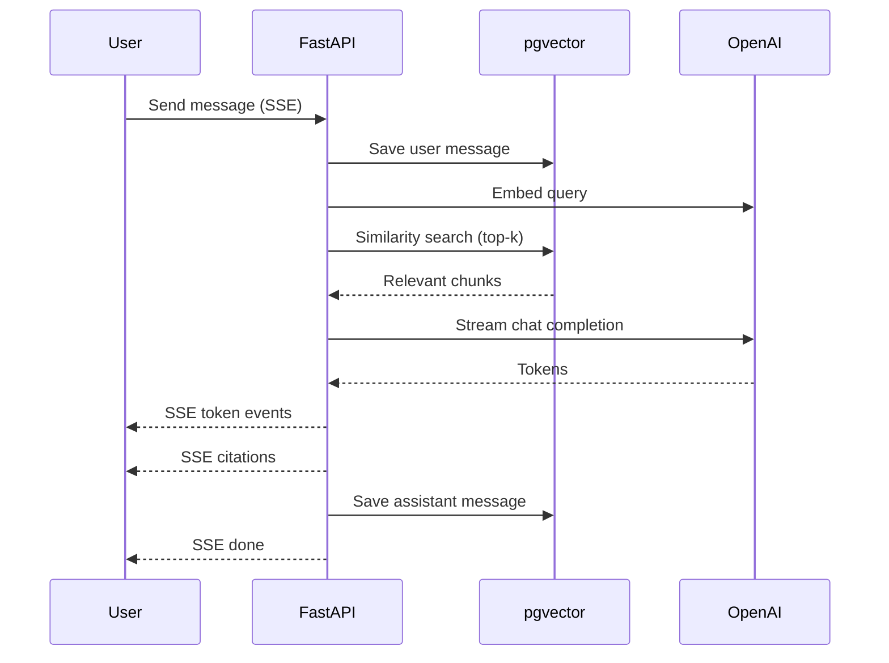

# Architecture Diagram

## System overview



## Document ingestion flow



## Chat / RAG flow



## API modules

```text
/api
├── /auth          Register, login, me
├── /workspaces    CRUD
├── /workspaces/{id}/documents   Upload, list, delete
├── /workspaces/{id}/summary     AI workspace overview
├── /workspaces/{id}/suggested-questions
└── /workspaces/{id}/chat/sessions   Streaming RAG chat
```
